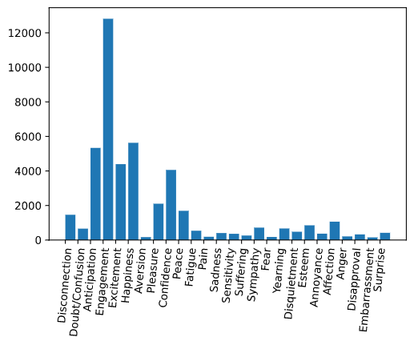
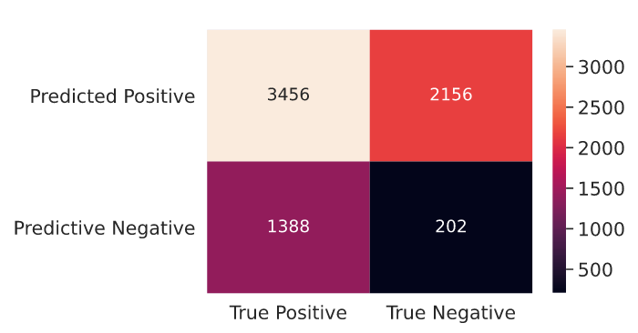

# How are you feeling?
---
Guessing what emotion someone is feeling is usually pretty easy for a human to do. How would you feel about guessing at 100?1000?1,000,000? different faces? I am willing to bet that even at those large numbers, most people would be fairly accurate but there is a catch; going through that many faces would most likely take up a lot of time. Even with that caveat though, that information is still very valuable so we are put in a position where machine learning excels: large data crunching to find patterns.

# Goal

Through using machine learning algorithm, in this case specifically a convolutional neural network(ConvNet/CNN), my goal is to make a model that when fed an image, it will be able to seek out the face within that image and return to us a prediction of what that person may be experiencing at the moment. It's uses would primarily be in marketing and scientific research to study more human behavior analysis.

# Dependencies

* Pandas
* Numpy
* Sklearn
* OpenCV 
* Tensorflow
* tqdm
* ast

# [Emotic Dataset](http://sunai.uoc.edu/emotic/)

*The EMOTIC dataset, named after EMOTions In Context, is a database of images with people in real environments, annotated with their apparent emotions. The images are annotated with an extended list of 26 emotion categories combined with the three common continuous dimensions Valence, Arousal and Dominance.*

*R. Kosti, J.M. Álvarez, A. Recasens and A. Lapedriza, "Context based emotion recognition using emotic dataset", IEEE Transactions on Pattern Analysis and Machine Intelligence (PAMI), 2019.*

To use this particular model you will need to be using the EMOTIC Dataset provided here[http://sunai.uoc.edu/emotic/]. The data provided here can be split into to type: categorical and continuous. This is important particularly for us as using a CNN you will need to deal with difference before inputing it into the CNN. The categorical data are predicted emotion(s), Gender, and Age. While the other two may not be included in this initial model, they are still valuable sources of data that can be used in a future iteration of this model. The cremaining data are BBox(Boundry boxes for where the face in the image is), Negative/Positive, Calm, Active, Dominated/ In Control. As with the Gender and Age data, besides the BB data, the remainder is still valuable and will be put to the side for now. This dataset furthermore already comes in three parts: training, testing, and valuation sets. Each file has 9 columns with the training set having 23,265 rows, testing having 7,202 rows, and validation having 3,314 rows. 

# Convolutional Neural Networks (CNN/ConvNet)

*The image above is purely for explanation purposes of how the model works and not representative of the model itself.*
CNN models are designed to deal particularly with image classification which is the reason we went with this type of algoithym. Above is shown the structure as to how a CNN functions.
 
# Instructions

*In the code's current structure, the model is unable to be created. Once the mat_to_csv.py file and the model_maker.py files are both recovered and corrected, the set up and execution will function as described below*
Before proceeding to the model itself, some pre-processing is in order. The emotic images and emotic dataset will be needed to be downloaded from the website and moved into the "Data" folder. One of the files will be in Matlab Structures(*.mat*) format. Running the mat_to_csv.py will then proceed to convert the file into a folder in the directory called "emotic_pre"(pre-processing). Inside should be three .csv files each called "test.csv", training.csv", and "val.csv". At this point, all that should be necessary is to run the "model_make.py" file. Running "model_maker.py" will begin using functions from the "library.py" file to pre-process the images before use all the pre-processed images with the "emotic_pre" and produce a CNN model! 

# Results

This image is an example of our results! The model that made this image had a 48% accuracy which was hgiher than expected with using 8 emotional categories(Random chance would have it be 12.5%.). It was run on a subset of the full range of emotions in an attempt to increase this accuracy. Overall, we have a precision of 0.6191, accuracy of .4879%, Sensitivity of 0.7091. So our model got the correct emotion about 62% when it did find a face and 48% overall. Below is shown a heatmap from testing the model.

# Next Steps:
## Correct the models current missing files
## Improve the model so that it may accept all the data from the Emotic's dataset
## Create a version that works live on a webcam

