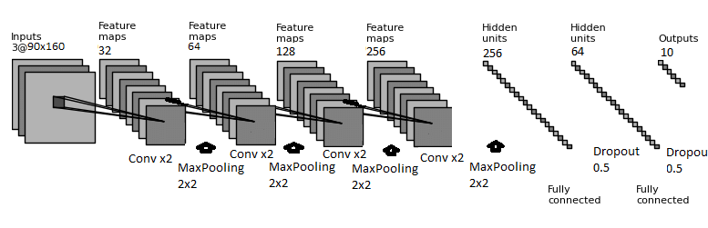

# How are you feeling?
---
In this day and age, AI

# Goal

Make a model that when fed an image can find a face and estimate as to what emotion the individual is experiencing.

# Needed to Run

* Pandas
* Numpy
* OpenCV - cv2
* Tensorflow
* tqdm

# Data 
[Emotic Dataset](http://sunai.uoc.edu/emotic/)

*R. Kosti, J.M. Álvarez, A. Recasens and A. Lapedriza, "Context based emotion recognition using emotic dataset", IEEE Transactions on Pattern Analysis and Machine Intelligence (PAMI), 2019.*

This dataset is broken up into two different kind of measurments: categorical and continuous. For our purposes at this moment, we will just need a subset of the categorical emotions.

# CNN

The example above is purely for explanation purposes of how the model works and not representative of the exact numbers or layers.

# Results
